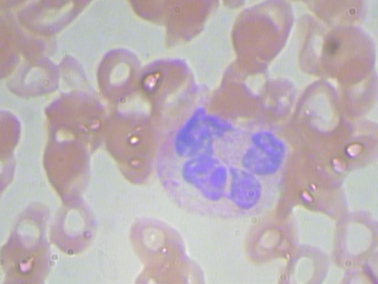
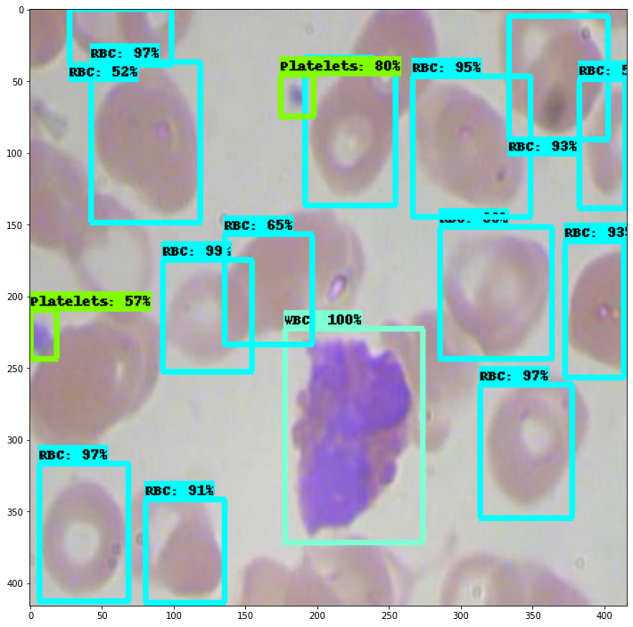
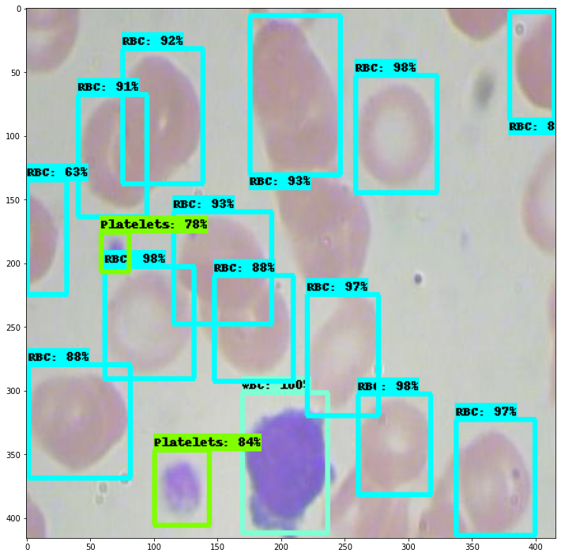
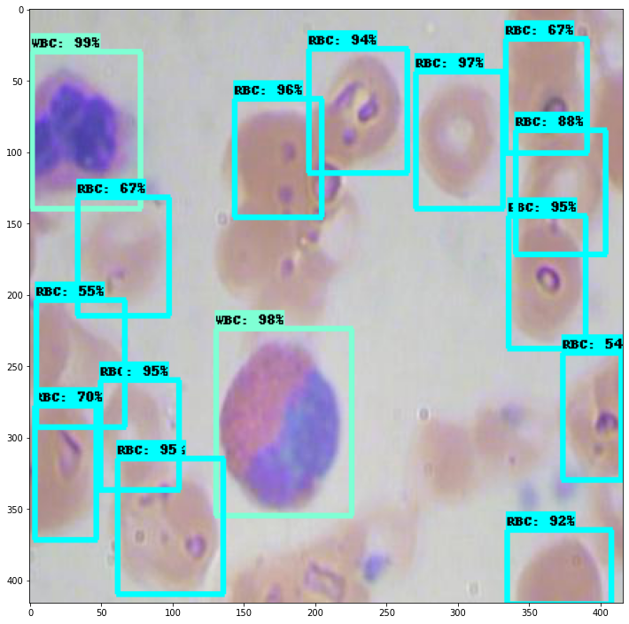
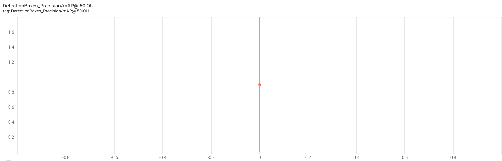
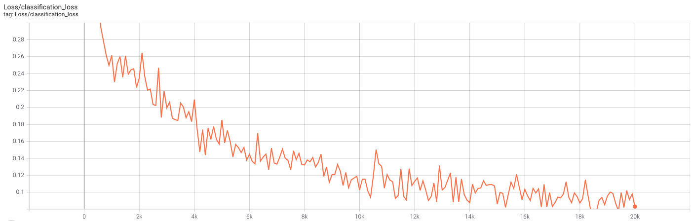

# Blood-Cell-Detection-TFOD-2.0

This project demonstrates the use of TensorFlow Object Detection API to automatically detect Red Blood Cells (RBCs), White Blood Cells (WBCs), and Platelets in each image taken via microscopic image readings.

The dataset used in this project was collected from [here](https://github.com/Shenggan/BCCD_Dataset).

The project directory structure looks like:

```
.
├── BCCD-Dataset
│   ├── test
│   └── train
├── LICENSE
├── README.md
├── annotations
│   └── label_map.pbtxt
├── assets
│   └── example.jpeg
├── export_tflite_graph_tf2.py
├── exporter_main_v2.py
├── generate_tfrecord.py
├── model_main_tf2.py
├── models
│   └── pipeline.config
├── output_images
│   ├── four.png
│   ├── one.png
│   ├── three.png
│   └── two.png
└── results_graph
    ├── classification_loss.png
    └── total_loss.png
```

I followed the official [TensorFlow Object Detection API documentation](https://github.com/tensorflow/models/tree/master/research/object_detection) to kickstart the training process on Google Colab Pro using Cloud GPU to export the inference graph.

I used a EfficientDet D0 based architecture,since it yields a pretty good `mAP@.50IOU` of around **90.14%**. <br> 
The `results_graph` folder contains the graph _classification_loss_ during training.


Source: https://arxiv.org/abs/1911.09070

## Sample Image


## Inference
Here are some results after running the trained model on some test images:
<p>
    
     <br>
    
    
</p>

## Results

 <br>
**mAP@0.50IOU**

 <br>
**Classification Loss**


## Further undertakings
* Optimise the model using the [OpenVINO toolkit](https://software.intel.com/en-us/openvino-toolkit) 
* Convert the _saved_model_ to .tflite
* To be paired with microscopes used by pathologists

## Acknowledgements
I am thankful to [Sayak Paul](https://sayak.dev) for guiding me in this project.

## Developed & Maintained by
👨 [Sayan Nath](https://sayannath.biz)
